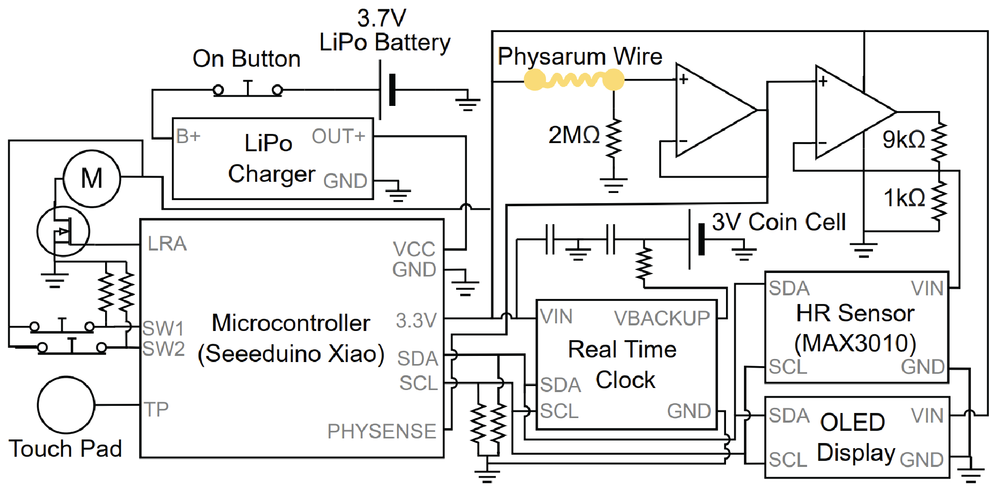
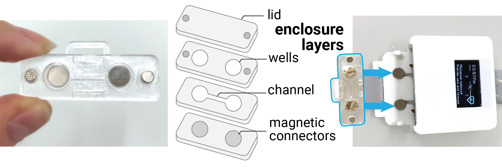

# Integrating Living Organisms to Implement Care-based Interactions

This repository contains design files to replicate the slime mold integrated smartwatch presented in the paper ["Integrating Living Organisms to Implement Care-based Interactions"](https://dl.acm.org/doi/abs/10.1145/3526113.3545629), which appeared at UIST2022. The smartwatch is a prototype exploring a living media interface that requires the user to care for the organism (slime mold, aka Physarum Polycephalum) that is integrated inside it in order for the functionality (it's heart rate sensor) to work. This device was designed by Jasmine Lu and Pedro Lopes at the University of Chicago's [Human Computer Integration Lab](https://lab.plopes.org).

[Paper](https://lab.plopes.org/published/2022-UIST-IntegratingLivingOrganisms.pdf) | [Video](https://youtu.be/Bex91KV56PQ) | [UIST'22 Talk](https://youtu.be/VkC54ZNO_HU?t=18566)

## Device Hardware
The slime mold integrated smart watch is a standard maker-friendly smartwatch with a display, RTC, and heart rate sensor. However, it's specifically engineered to rely on the slime mold to form a conductive wire. An overview of the whole system can be seen below.

### Device Components
Below is a list of all the components required for to make this device. For the enclosures, the current design does require access to a 3D printer and a laser cutter. The current design also requires the manufacturing of a PCB (and ordering of small electronic components). 

#### Materials
* Clear acrylic sheets (2mm and 1.5mm)
* Acrylic Glue
* PLA for 3D printing
* Watch Strap - [Amazon Link](https://www.amazon.com/gp/product/B085PXB8CV/)
* Neodynium Magnets (6mm x 2mm and 3mm x 2mm) - [Link 1](https://www.amazon.com/gp/product/B07KJ9H31P) [Link 2] (https://www.amazon.com/ETHCOOL-Magnets-Warhammer-Miniatures-Projects/dp/B09MVYGX1X)
* Copper Tape

#### Electronic Components
* Seeeduino Xiao Microcontroller - [Link](https://www.seeedstudio.com/Seeeduino-XIAO-Arduino-Microcontroller-SAMD21-Cortex-M0+-p-4426.html)
* MAX3010X Heart Rate Sensor Breakout - [Link](https://www.amazon.com/dp/B08ZNFF7H2)
* Lithium Battery Charging Module - [Link](https://www.amazon.com/Lithium-Battery-Charging-Protection-Functions/dp/B07MDPLQ18)
* Latching Switch (for On/Off Button)
* Vibromotor/LRA - [Link](https://nfpshop.com/product/6mm-brushless-coin-vibration-motor-2-5mm-type-model-nfp-ws0625)
* OLED display - [Link](https://www.amazon.com/Dorhea-Display-3-3V-5V-Arduino-Raspberry/dp/B0837DLWVH/)
* SMD Reistors (0805): 10K (5), 9K (1), 1K (1), 470 (1), 2M (1)
* SMD Capacitors (0805): 100nF (2),
* SMD RTC - RV-3028-C7 - [Link](https://mou.sr/3UEpNhk)
* SMD RTC Coin Cell Battery - [Link](https://www.arrow.com/en/products/ml-621sdn/panasonic%3Fregion=nac&utm_source=findchips&utm_medium=aggregator&utm_currency=&utm_campaign=arrow_findchips_2021_Americas&utm_content=inv_listing&utm_term=backorder)
* SMD MOSFET - SSM3K15ACTC - [Link](https://mou.sr/3hI601T)
* SMD Dual OpAmp - SOP65P490X110-8N - [Link](https://www.digikey.com/en/products/detail/microchip-technology/MCP6542T-I-SN/458455)

### Device Enclosure
The 3D Models (as STL files) for the Device Case are included in this repo [here](./Device_Enclosure_STL). This includes both the main case and case for power/charging circuit (batteries, charging module, on/off button).
These models are designed to fit the designed PCB, OLED display, MAX3010 HR Sensor, Physarum Wire Enclosure, a copper tape capacitive touch Sensor, and a small vibromotor. Future designs will likely include a smaller form factor - if you're interested in redesigning this, please get in touch!

### Slime Mold Enclosure
The slime mold wire enclosure is made by lasercutting acrylic pieces and binding them together with acrylic glue. The vector files for these cuts were designed in Adobe Illustrator and can be found [here](./Slime_Mold_Enclosure_VectorCuts). There are also holes for 6x2mm Neodymium Magnets on the bottom layer and holes for 3x2mm magnets on the top layer and in the enclosure lid layer. An overview of these layers is shown in the figure below.

### PCB Design Files
Our PCB was designed with KiCAD. You can find all KiCAD project files [here](./PCB_Design_Files). For an overview of what the PCB looks like, you can refer to the figure below.

## Slime Mold and How to Care for them
The key to this device is growing a slime mold wire. For more information on how to grow and care for a slime mold - you can see the care instructions I've made [here](https://drive.google.com/file/d/1Qz3SxQu3I3aJ-D0hYsuum45GsUVl9gFx/view?usp=sharing). (Note these are somewhat specific to a provided kit at the UIST22 conference. If you'd like some slime mold and maybe a kit too, feel free to reach out!)

Other resources for growing and playing around with slime mold include the [Slime Mold Collective](https://slimoco.ning.com/) and [Physarum Computing Research](https://link.springer.com/book/10.1007/978-3-319-26662-6).

## Citation

When using or building upon this device/work in an academic publication, please consider citing as follows:

Jasmine Lu, Pedro Lopes. 2022. Integrating Living Organisms in Devices to Implement Care-based Interactions. In Proceedings of ACM Symposium on User Interface Software and Technology 2022 (UIST’2022). Association for Computing Machinery, New York, NY, USA. https://doi.org/10.1145/3526113.3545629

## Contact
For questions or if something is wrong with this repository, contact jasminelu@uchicago.edu

