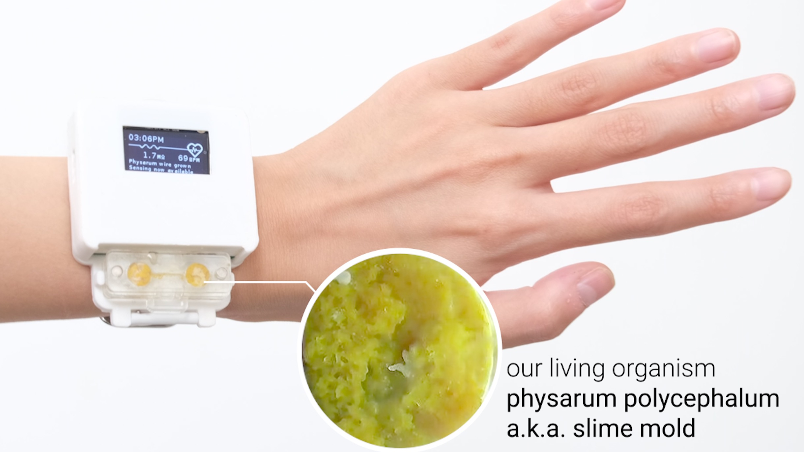

# Integrating Living Organisms to Implement Care-based Interactions

This repository contains design files to replicate the slime mold integrated smartwatch presented in the paper ["Integrating Living Organisms to Implement Care-based Interactions"](https://dl.acm.org/doi/abs/10.1145/3526113.3545629), which appeared at UIST2022. The smartwatch is a prototype exploring a living media interface that requires the user to care for it in order for the functionality (it's heart rate sensor) to work. This device was designed by Jasmine Lu and Pedro Lopes at the University of Chicago's [Human Computer Integration Lab](https://lab.plopes.org)

## Device Hardware
The slime mold integrated smart watch is a standard maker-friendly smartwatch with a display, RTC, and heart rate sensor. However, it's specifically engineered to rely on the slime mold to form a conductive wire. An overview of the whole system can be seen below.

### Device Enclosure

### Physarum Enclosure

### Electronic Components

### PCB Design Files

## Device Software

## Slime Mold and How to Care for them

## 

